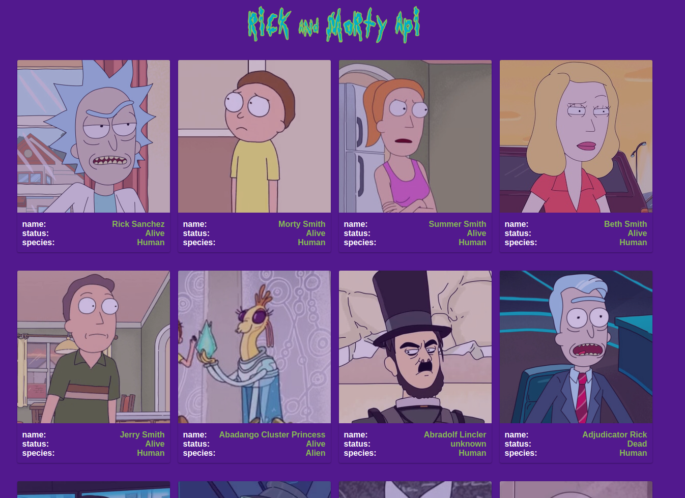

# RickNMortyApp

This project was generated with [Angular CLI](https://github.com/angular/angular-cli) version 13.1.2. 

Made with love just for fun prupouses.

Thanks to [@cheatmodes4](https://twitter.com/cheatmodes4/status/1499123518990168072?s=20&t=gtGxilcon9MMaVZZ4KwLmQ) on Twitter for push me to do it :D 

The rules the challenge

1. Use the [Rick and Morty API](https://rickandmortyapi.com/)
1. Just 1 component (`app.component`)
1. Just 2 .js files/folders (`app.component.ts` and `rick-and-morty-api.service.ts`)
1. Just 1 styles file (`styles.scss`)